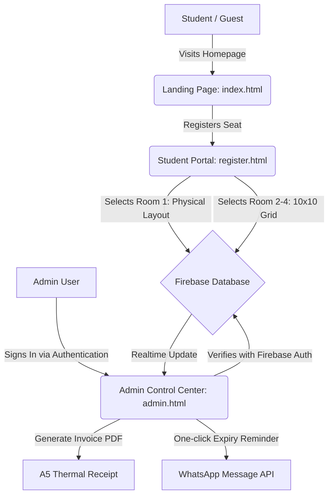

<div align="center">
  # 📚 The Study Cafe — Portal Control Center

  [](https://firebase.google.com/)
  [](https://sachinmandawi.github.io/Library/)
  [](https://opensource.org/licenses/MIT)

  <p align="center">
    <strong>A futuristic, shift-free study library management portal. Featuring real-time seating grids, custom physical room mappings, instant WhatsApp notifications, and secure authentication.</strong>
  </p>

  <br />

  ### 🔗 Live Applications

  [](https://sachinmandawi.github.io/Library/index.html)
  [](https://sachinmandawi.github.io/Library/admin.html)
  [](https://sachinmandawi.github.io/Library/register.html)
</div>

---

## ⚡ Main Highlights

### 🔒 Firebase Shield Access Control
* **Authentication Overlay:** Direct blurred glassmorphism modal blocks unauthorized access to the Control Center.
* **Password Eye Toggle:** Password visibility button toggles between dot characters and readable plaintext to prevent typing errors.
* **Realtime State Observer:** Automatically detaches listeners when signed out to safeguard against database read/write leaks.

### 🗺️ Room 1 Custom Physical Layout
* **Physical Mapping:** Visually represents Room 1's **50 physical desks** grouped into structural blocks (Top Row, Middle-Left, Middle-Right, Outer Left, and Outer Right) with clear partition walkways and a gate emoji indicator (`🚪 Gate`).
* **Grid Fallback:** Automatically switches to the standard 10x10 grid layout for Room 2, 3, and 4 (up to 100 seats each).
* **Cross-App Layout Sync:** The layout configuration renders identically on the Admin Dashboard and the Student Registration Portal.

### 💬 Auto WhatsApp Alerts & Invoicing
* **One-Click Alerts:** Direct API trigger generates pre-formatted template messages for expiring or expired memberships.
* **A5 PDF Generator:** Compiles dynamic registration invoices incorporating custom library headers, address, and Support contact numbers.

---

## 🗺️ System Flow Architecture



---

## 🛠️ Technology Stack

* **Frontend Engine:** Vanilla HTML5, Advanced CSS3 custom properties (CSS variables), ES6 modules.
* **Database & Synchronization:** Google Firebase RTDB and cross-tab synced `localStorage` using `BroadcastChannel`.
* **External PDF Compiler:** `html2pdf.js` for dynamic high-quality clientside document generation.
* **UI Components:** Google Fonts (Outfit, Inter) and Font Awesome 6 Icon Library.

---

## 🚀 Setup & Credentials Configuration

<details>
<summary>🔑 <b>How to Add the Admin User inside Firebase Console (Step-by-Step)</b></summary>

If your login screen returns an **"Invalid email or password"** error, you must register the admin account in your Firebase database:

1. Open your [Firebase Console](https://console.firebase.google.com/).
2. Select your project **test-560c6**.
3. Under the **Build** section in the left sidebar, click on **Authentication**.
4. *If using Authentication for the first time, click "Get Started".*
5. Select the **Sign-in method** tab, click **Email/Password**, and toggle it to **Enabled**, then click **Save**.
6. Switch to the **Users** tab and click **Add user**.
7. Enter your chosen admin credentials:
   * **Email:** `your-admin-email@example.com`
   * **Password:** `your-strong-password`
8. Click **Add user**. Now go back to your app login screen and sign in!
</details>

<details>
<summary>💻 <b>Running Locally & Development Server</b></summary>

To host the pages locally on your system, you can use any static server. For example:
```bash
# Start a simple dev server
npx http-server -p 8080
```
Then visit:
* Homepage: `http://localhost:8080/index.html`
* Admin: `http://localhost:8080/admin.html`
* Student Portal: `http://localhost:8080/register.html`
</details>

---

<div align="center">
  <sub>Developed with ❤️ for <strong>The Study Cafe</strong>.</sub>
</div>
