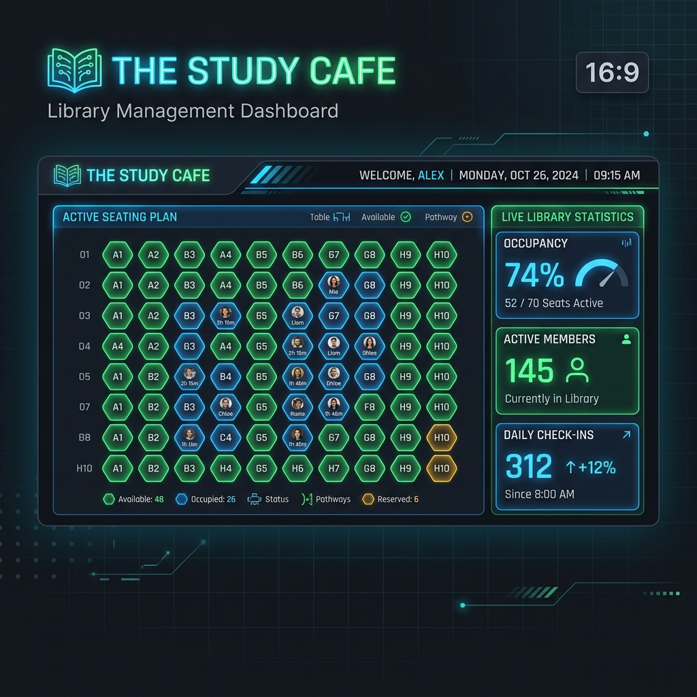

<div align="center">
  

  # 📚 The Study Cafe — Portal Management System

  [](https://firebase.google.com/)
  [](https://sachinmandawi.github.io/Library/)
  [](https://opensource.org/licenses/MIT)

  <p align="center">
    <strong>A futuristic, shift-free study library management portal. Featuring real-time seating grids, instant WhatsApp notifications, and automated billing.</strong>
  </p>

  <br />

  ### 🔗 Live Applications

  [](https://sachinmandawi.github.io/Library/index.html)
  [](https://sachinmandawi.github.io/Library/register.html)
</div>

---

## ✨ Features

### 🟢 Realtime 400-Seat Seating Grid
* **Visual Representation:** Interactive visual grids spanning **4 rooms (100 seats each)**.
* **Color Code Legends:** 
  * 🔵 **Reserved (Occupied):** Shows who sits where with a blue glow.
  * 🔴 **Maintenance (Repair):** Highlights blocked seats under repair.
  * ⚪ **Available (Vacant):** Neutral gray seats ready for assignment.
* **Double Booking Protection:** Automated client and server-side checks prevent overlapping assignments.

### 💸 Flexible Non-Reserved Seating Support
* **Seating Type Selector:** Choose between "Reserved" (locked cabin desks) and "Non-Reserved" (flexible floating desk space).
* **Smart UI Hiding:** Dynamically hides the visual seat picker for non-reserved requests and labels seat locations as **N/A / Flexible** in receipts, directories, and tables.

### 📅 Auto WhatsApp Expiry Alerts (English)
* **Instant Expiry Notifications:** One-click reminder button next to expiring/expired student lists on the dashboard.
* **Dynamic Content Generator:** Crafts professional pre-formatted English WhatsApp reminder messages:
  * *Hello [Student], your membership for Seat X (Room Y) expires tomorrow. Please renew to retain your desk...*
* **Phone Number Sanitizer:** Strips leading zeroes and wraps numbers automatically with `+91` country code.

### 📄 Smart PDF & Print Receipt Generator
* **One-Click PDF Download:** Integrates `html2pdf.js` for fast high-resolution A5 invoice generation.
* **Support Integration:** Instantly binds the custom Library Support phone number and address configured in settings.

### 🔍 Advanced Member Directory Filters
* **Dropdown Filtering:** Sort students by subscription status (Active, Expired, Expiring), Seat Type, Room No, Target Exam, Payment Status, Payment Method, and Package Duration.
* **Interactive Clear Action:** A "Clear Filters" button to reset all criteria and searches instantaneously.

---

## 🛠️ Technology Stack

* **Frontend:** Clean Vanilla HTML5, CSS3 Variables, ES6 JavaScript.
* **Database & Sync:** Google Firebase Realtime Database with cross-tab local `storage` and `BroadcastChannel` syncing.
* **Exporting:** `html2pdf.js` for client-side PDF compilation.
* **Fonts & Icons:** Google Fonts (Outfit, Inter) and Font Awesome 6.

---

## 🚀 Quick Start Guide

### 1. Run Locally
Open the files directly in any web browser, or launch a local web server:
```bash
npx http-server -p 8080
```
Then visit:
* **Admin Dashboard:** `http://localhost:8080/index.html`
* **Student Registration:** `http://localhost:8080/register.html`

### 2. Connect Your Own Database
Go to the **Database Settings** tab at the bottom of the sidebar:
1. Enter your custom Firebase API Credentials.
2. Click **Save Configuration & Connect**.
3. The application will instantly switch to your private cloud storage!

---

<div align="center">
  <sub>Developed with ❤️ for <strong>The Study Cafe</strong>.</sub>
</div>
